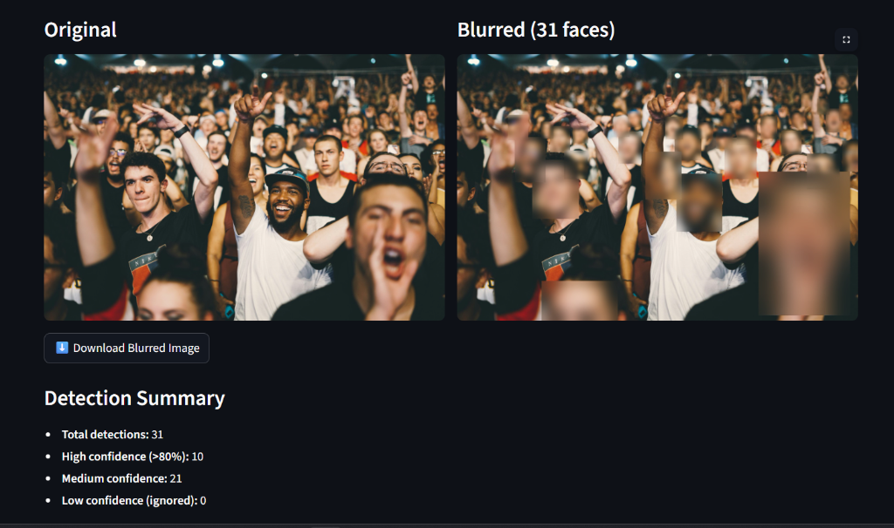

#  Face Blur on Surveillance Videos & Images

A **production-grade** Python pipeline for detecting and anonymising every visible human face in surveillance-style videos and images using deep learning.

Built with **InsightFace/RetinaFace** for detection, **ByteTrack** for tracking, and **OpenCV** for processing.

<br>
<p align="center">
  
</p>
<br>
---

##  Features

| Feature | Description |
|---------|-------------|
|  **Deep Learning Detection** | InsightFace (RetinaFace) — far superior to Haar cascades |
|  **Challenging Conditions** | Side profiles, partial faces, low light, motion blur, compression artefacts |
|  **Multi-Object Tracking** | ByteTrack via `supervision` — persistent IDs across frames |
|  **Temporal Smoothing** | Continues blur when detection briefly fails (prevents identity leaks) |
|  **Frame Enhancement** | Denoise → CLAHE → Gamma correction → Optional sharpening |
|  **Dual Blur Modes** | Gaussian blur & pixelation — switchable via CLI/config |
|  **Video Processing** | Full MP4 pipeline with audio preservation via ffmpeg |
|  **Image Processing** | Single image & batch directory processing |
|  **Debug Outputs** | Detection boxes, confidence scores, tracker IDs visualised |
|  **Streamlit Web UI** | Interactive drag-and-drop interface with download buttons |
|  **Batch Processing** | Process entire directories of videos or images |
|  **Docker Support** | Dockerfile included for containerised deployment |
|  **GPU Acceleration** | Auto-detects CUDA; falls back to CPU gracefully |

---

## Architecture

```
┌──────────────┐     ┌──────────────────┐     ┌──────────────────┐
│   Input      │     │  Frame Enhancer  │     │  Face Detector   │
│  (Video/Img) │────▶│  (enhance.py)    │────▶│  (detector.py)   │
│              │     │  • Denoise       │     │  • InsightFace   │
└──────────────┘     │  • CLAHE         │     │  • RetinaFace    │
                     │  • Gamma         │     │  • Confidence    │
                     │  • Sharpen       │     │    tiering       │
                     └──────────────────┘     └────────┬─────────┘
                                                       │
                              ┌─────────────────────────┘
                              ▼
                     ┌──────────────────┐     ┌──────────────────┐
                     │  Face Tracker    │     │  Face Blurrer    │
                     │  (tracker.py)    │────▶│  (blur.py)       │
                     │  • ByteTrack     │     │  • Gaussian      │
                     │  • Temporal      │     │  • Pixelation    │
                     │    smoothing     │     │  • Dynamic scale │
                     └──────────────────┘     └────────┬─────────┘
                                                       │
                              ┌─────────────────────────┘
                              ▼
                     ┌──────────────────┐
                     │  Output          │
                     │  • Blurred MP4   │
                     │  • Blurred image │
                     │  • Debug frames  │
                     │  • Logs          │
                     └──────────────────┘
```

---

##  Project Structure

```
face_blur_project/
│
├── app/                          # Core application modules
│   ├── __init__.py               # Package init
│   ├── config.py                 # Central configuration
│   ├── detector.py               # InsightFace/RetinaFace detector
│   ├── tracker.py                # ByteTrack multi-object tracker
│   ├── blur.py                   # Gaussian & pixelation blur
│   ├── enhance.py                # Frame preprocessing pipeline
│   ├── video_processor.py        # End-to-end video processing
│   ├── image_processor.py        # End-to-end image processing
│   └── utils.py                  # Shared utilities
│
├── datasets/                     # Downloaded sample data
│   ├── videos/                   # Sample MP4 videos
│   ├── images/                   # Sample images with faces
│   └── downloaded/               # Raw downloads
│
├── outputs/                      # Processing outputs
│   ├── blurred_videos/           # Blurred video files (MP4)
│   ├── blurred_images/           # Blurred image files
│   └── debug/                    # Debug visualisations & logs
│
├── sample_inputs/                # Quick-test samples
│   ├── sample_video.mp4
│   └── sample_image.jpg
│
├── scripts/                      # Automation scripts
│   ├── download_dataset.py       # Download sample data
│   ├── run_video.py              # Batch video processing
│   └── run_image.py              # Batch image processing
│
├── main.py                       # CLI entry point
├── streamlit_app.py              # Web UI
├── requirements.txt              # Python dependencies
├── Dockerfile                    # Docker container support
└── README.md                     # This file
```

---

##  Installation

### Prerequisites

- **Python 3.11+**
- **ffmpeg** (for audio preservation & video conversion)
- **CUDA** (optional, for GPU acceleration)

### Step 1 — Clone & navigate

```bash
cd face_blur_project
```

### Step 2 — Create virtual environment (recommended)

```bash
python -m venv venv

# Windows
venv\Scripts\activate

# macOS/Linux
source venv/bin/activate
```

### Step 3 — Install dependencies

```bash
# CPU-only
pip install -r requirements.txt

# GPU (CUDA) — replace onnxruntime with GPU version
pip install -r requirements.txt
pip install onnxruntime-gpu --upgrade
```

### Step 4 — Install ffmpeg

```bash
# Windows (using Chocolatey)
choco install ffmpeg

# macOS
brew install ffmpeg

# Ubuntu/Debian
sudo apt install ffmpeg
```

### Step 5 — Download sample data

```bash
python scripts/download_dataset.py
```

---

## Usage

### Quick Start (The Easy Way)
We've included scripts that will automatically create a virtual environment, install dependencies, download the sample datasets, trim them, and launch the Streamlit web interface.

**On Windows:**
Double-click `run_windows.bat` or run it from the command line:
```cmd
run_windows.bat
```

**On Linux/Mac:**
```bash
bash run_linux_mac.sh
```

### CLI Commands

```bash
# Process a single video
python main.py --video sample_inputs/sample_video.mp4

# Process a single image
python main.py --image sample_inputs/sample_image.jpg

# Use pixelation mode
python main.py --video sample_inputs/sample_video.mp4 --mode pixelate

# Enable debug output (detection boxes, tracker IDs)
python main.py --video sample_inputs/sample_video.mp4 --debug

# Custom confidence threshold
python main.py --image sample_inputs/sample_image.jpg --confidence 0.5

# Batch process a directory of images
python main.py --input-dir datasets/images/

# Batch process a directory of videos
python main.py --input-dir datasets/videos/ --type video

# Custom output directory
python main.py --image sample_inputs/sample_image.jpg --output-dir ./my_output/
```

### Streamlit Web UI

```bash
streamlit run streamlit_app.py
```

Then open http://localhost:8501 in your browser.

### Convenience Scripts

```bash
# Process all downloaded videos
python scripts/run_video.py

# Process all downloaded images
python scripts/run_image.py

# Process with debug + pixelation
python scripts/run_image.py --mode pixelate --debug
```

---

## Configuration

All parameters are in [`app/config.py`](app/config.py):

| Parameter | Default | Description |
|-----------|---------|-------------|
| `blur_mode` | `"gaussian"` | `"gaussian"` or `"pixelate"` |
| `gaussian_kernel_base` | `51` | Base kernel size (scaled by face size) |
| `pixelate_block_size` | `10` | Block size for pixelation |
| `confidence_high` | `0.8` | Definite blur threshold |
| `confidence_medium` | `0.4` | Tracker-assisted threshold |
| `bbox_padding` | `0.15` | 15% padding around face boxes |
| `temporal_smoothing_frames` | `5` | Frames to continue blur after loss |
| `enhance_denoise` | `True` | Enable frame denoising |
| `enhance_clahe` | `True` | Enable contrast enhancement |
| `enhance_gamma` | `True` | Enable low-light correction |
| `enhance_sharpen` | `False` | Enable blur sharpening |

---

## Sample Results

After running the pipeline, check:

- `outputs/blurred_videos/` — Final MP4 files
- `outputs/blurred_images/` — Final JPG/PNG files
- `outputs/debug/` — Tracking and detection visualisations
- `outputs/debug/pipeline.log` — Processing logs

---

## Docker

```bash
# Build the image
docker build -t face-blur .

# Process a video
docker run --rm \
  -v $(pwd)/sample_inputs:/data/input \
  -v $(pwd)/outputs:/data/output \
  face-blur --video /data/input/sample_video.mp4 --output-dir /data/output

# Run Streamlit UI
docker run --rm -p 8501:8501 face-blur \
  streamlit run streamlit_app.py --server.address 0.0.0.0
```

---

## Future Improvements

- [ ] **Real-ESRGAN** super-resolution for upscaling low-res CCTV footage before detection
- [ ] **DeblurGAN-v2** for motion deblurring
- [ ] **ONNX export** for edge deployment
- [ ] **Face mask visualisation toggle** (mask overlay instead of blur)
- [ ] **Selective blur** — choose which faces to blur by ID
- [ ] **Real-time webcam mode** with live preview
- [ ] **REST API** endpoint for cloud deployment
- [ ] **Multi-GPU** support for large-scale batch processing
- [ ] **Model benchmarking** — compare RetinaFace vs YOLOv8-face

---

## License

This project is for educational and research purposes.  
Sample data is sourced from publicly available datasets (Pexels, Unsplash).

---

## Acknowledgements

- [InsightFace](https://github.com/deepinsight/insightface) — Face detection & recognition
- [Supervision](https://github.com/roboflow/supervision) — ByteTrack tracking
- [OpenCV](https://opencv.org/) — Computer vision
- [Streamlit](https://streamlit.io/) — Web UI framework
- [Pexels](https://www.pexels.com/) — Sample video footage
- [Unsplash](https://unsplash.com/) — Sample images
